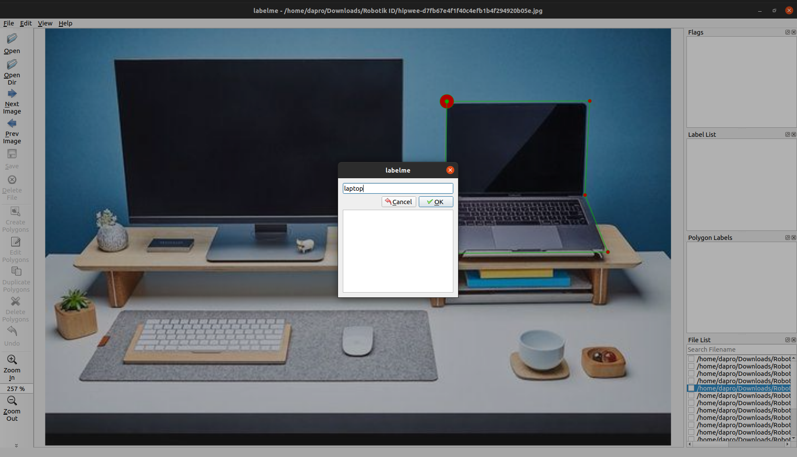

# yolo-tools

## Annotation Detection (Bounding Box)
* repo: https://github.com/heartexlabs/labelImg.git
### Install
* __Ubuntu__
* pip3 install labelImg

### Use
* Open Terminal
* labelImg <path_to_folder> <path_to_class_label>
* Example: labelImg . classes.txt
* Change Save Dir
* Change Save Format to Yolo
* Create RectBox
* Save and Next

## Annotation Segmentation
* repo: https://github.com/wkentaro/labelme.git
### Install
* __Ubuntu__
* sudo apt-get install labelme
* sudo pip3 install labelme

* __Windows__
* pip install labelme

### Use
* Open Terminal
* labelme 
* Open Dir
* Create Polygons
* Draw Object
* Save and Next

